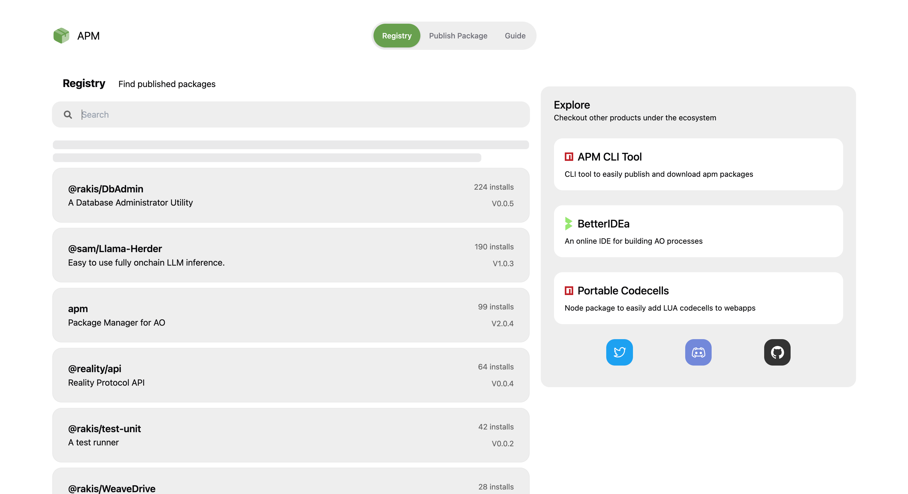
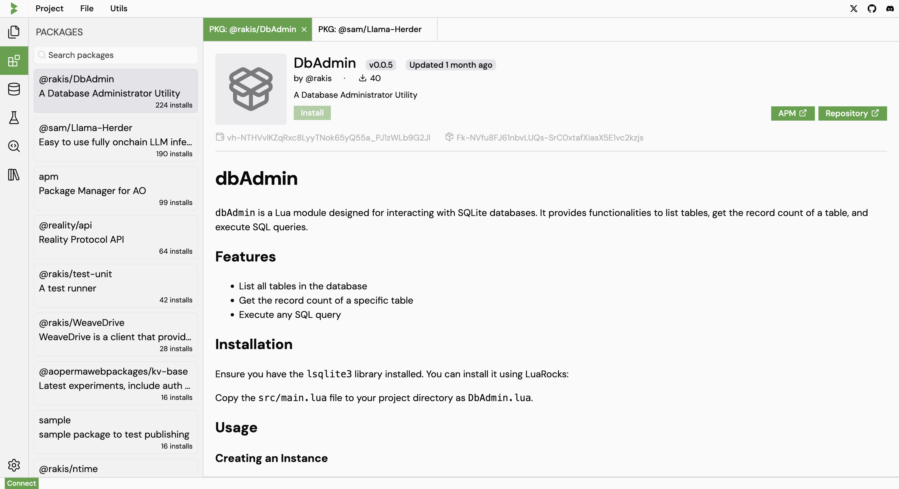

# APM web registry

Just like NPM, Ao Package Manager (APM) has a web registry that you can use to search for packages.
The web registry is available at [apm.betteridea.dev](https://apm.betteridea.dev).
Where you can browse, search and publish packages.

If you are using BetterIDEa, you can also explore packages through the packages tab in the sidebar. 

