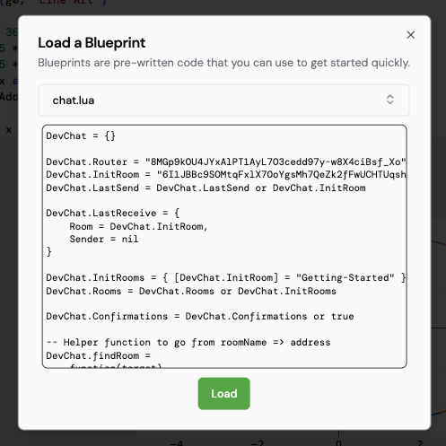

# Blueprints

Blueprints are lua code provided by [aos](https://github.com/permaweb/aos/tree/main/blueprints) to replicate common functions in any process.
These blueprints can be used to quickly add functionality to your process without having to write the code from scratch.

## Load a blueprint

To use a blueprint, click on the load blueprint button in menu > project > load blueprint.

This will open a dialog box where you can which blueprint you want to load. Once you have selected the blueprint, it will show the source code which will be loaded on the process. Click on the load button to load the blueprint.

