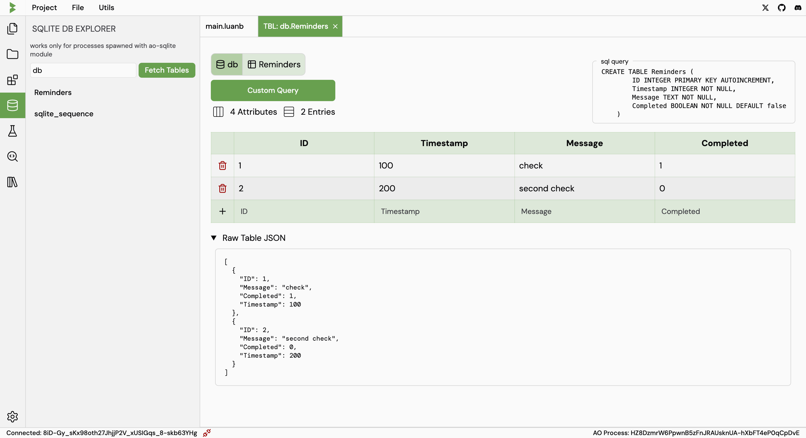

# SQLite DB Explorer

To visualise and interact with the AO-SQLite database, navigate to the `SQLite Explorer` tab from the left sidebar.

Here you need to enter the name of the variable in which the in-memory db is stored.

A list of tables will be displayed on the left side of the screen. Click on a table to view its contents.

