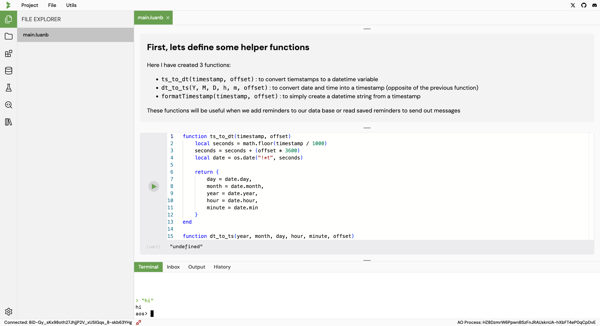

# File Modes

The IDE can create either normal files or notebook files. The difference between the two is the interface that you use to write code.

| File Extension | Interface      |
| -------------- | -------------- |
| `.lua`         | Simple file based |
| `.luanb`       | Notebook based |

## Notebook Interface

The notebook interface is a unique cell based editing interface that allows you to write code in cells and run them individually.

This is similar to Google Colab and Jupyter Notebooks, which also allows you to write markdown, latex or generate graphs

    
## File based interface

The file based editor is a more traditional code editor that allows you to write code in files and run them.

