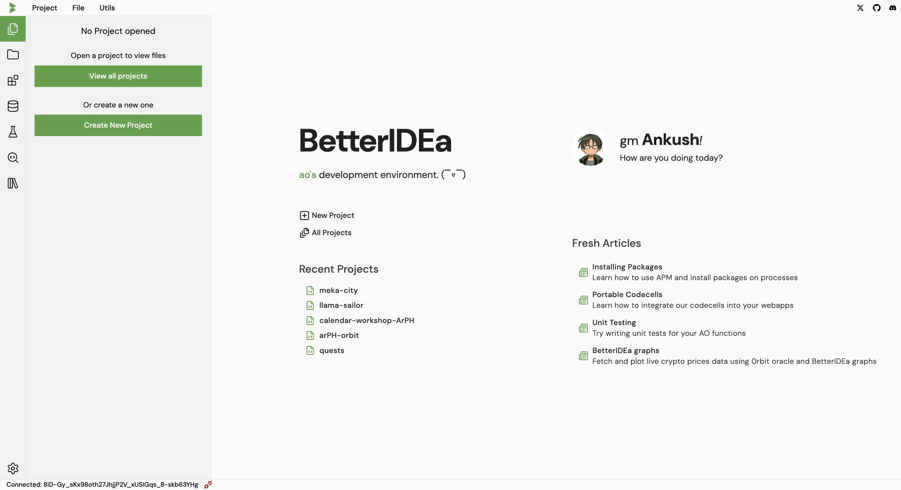

# Lets start building, shall we?

On visiting the [IDE](https://ide.betteridea.dev/), you will be greeted with this landing page.

Simply connect your ArConnect wallet and you are ready to start building your AO processes.

On the left you can view a list of your projects and the option to create a new one.

You can also create a new project from menu > project

Start by connecting your wallet and creating a new project.

{/* Enter a project name, choose a pre-existing process or create a new one to be used for this project.

If you choose to create a new process, you have to option to assign a name to the process.

Templates are predefined common code snippets that can be used to speed up the development process.

Next you have two options to choose from, the notebook interface or the file based editor. */}

| Option | Description | Default Value |
| ------ | ----------- | ------- |
| Project Name | Enter a name for your project |  |
| Default file type | Choose between a normal file or a notebook file | notebook |
| Process dropdown | Choose a pre-existing process or create a new one  (You can paste process ids here) | create new |
| Process name  (only if creating new process) | Value for the `Name` tag while spawning the process | project name |
| Cron Toggle  (only if creating new process) | Enable or disable the cron handler for the process | off |
| Cron Interval | Interval for the cron handler (number) | 1 |
| Cron Unit | Unit for the cron handler (seconds, minutes, hours, blocks) | minute |
| AO Process Module  (only if creating new process) | Module ID to use for spawning new process | 
| Upload project zip | Upload a zip file containing the project files |  |

