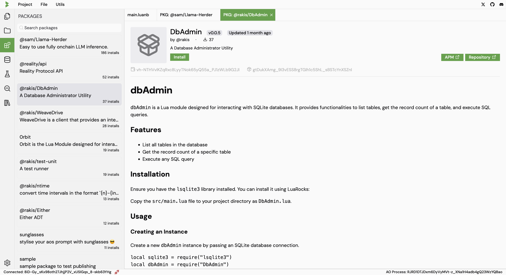

# Packages

## Install through GUI

You can explore and install packages from the package manager in the IDE.



## Install through CLI

You can also install packages by using the `apm` client tool.

Just load the apm blueprint and run the following commands to install packages

```lua
apm.update()

apm.install "package-name"
```