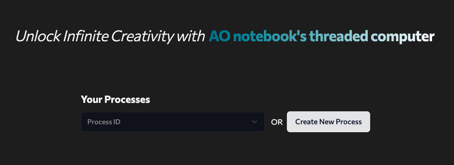
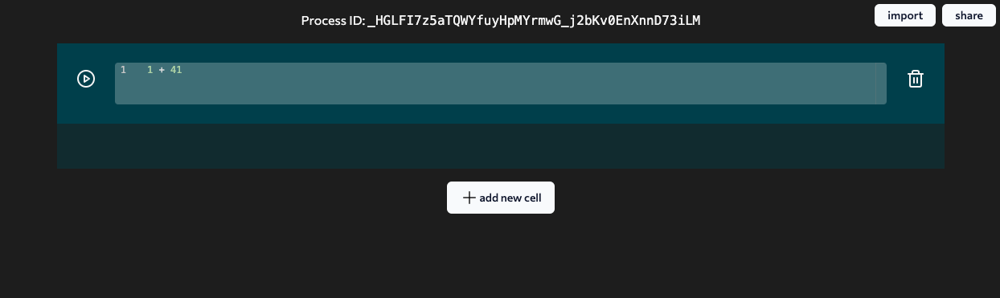
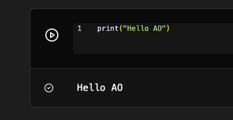

import { Callout } from 'nextra/components'

# First Process

After setting up the wallet, visit [ide.betteridea.dev](https://ide.betteridea.dev),
a wallet popup will appear asking for the password to connect to the IDE.

### Create a new process

### Write code

You will be presented with the notebook ui, where you can write your code.

Try chainging the default `1 + 41` to `print("Hello AO")` and click on the play button to run the code.

### Run code

Click on the play button to run the code.

---

Congrats, you have just run your first process on AO.

<Callout type="info" emoji="ℹ️">
  Running code for the first time takes some time, so please be patient.
</Callout>
