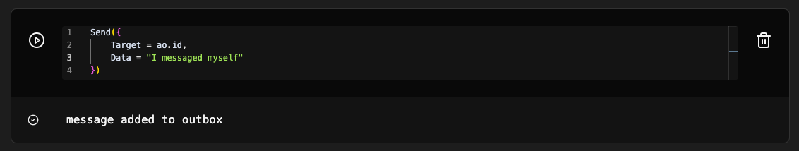
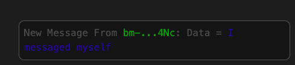

# Sending a message

```lua
Send({
    Target = "PROCESS_ID",
    Data = "YOUR_MESSAGE",
    ...
    additional tags
})
```

Lets try sending a message to the ourself. To get our own process id we use `ao.id` global variable



A popup appears on the bottom right, indicating we received a new message in our Inbox.


