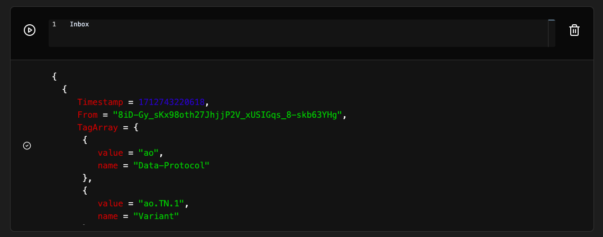
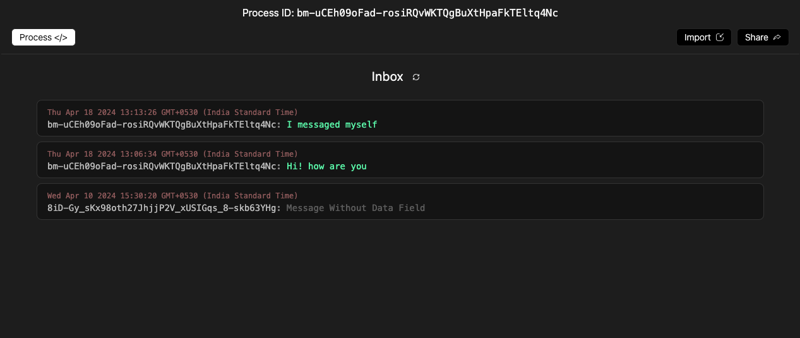

import { Callout } from 'nextra/components'

# Inbox Table

The `Inbox` table is a list of all the messages that have been sent to the process.

Upon running `Inbox` in a Notebook cell, a table similar to the following will be displayed



<details>
<summary>Example Inbox</summary>
```lua
{
  {
     Timestamp = 1710823293780,
     From = "R-9oSFkGOcEfU8j1taaCD27zozHI5yYH5Di5itcENHE",
     TagArray = {
      {
         value = "ao",
         name = "Data-Protocol"
      },
      {
         value = "ao.TN.1",
         name = "Variant"
      },
      {
         value = "Process",
         name = "Type"
      },
      {
         value = "9afQ1PLf2mrshqCTZEzzJTR2gWaC9zNPnYgYEqg1Pt4",
         name = "Module"
      },
      {
         value = "TZ7o7SIZ06ZEJ14lXwVtng1EtSx60QkPy-kh-kdAXog",
         name = "Scheduler"
      },
      {
         value = "aoconnect",
         name = "SDK"
      },
      {
         value = "text/plain",
         name = "Content-Type"
      }
     },
     Target = "_HGLFI7z5aTQWYfuyHpMYrmwG_j2bKv0EnXnnD73iLM",
     SDK = "aoconnect",
     Content-Type = "text/plain",
     Scheduler = "TZ7o7SIZ06ZEJ14lXwVtng1EtSx60QkPy-kh-kdAXog",
     Owner = "R-9oSFkGOcEfU8j1taaCD27zozHI5yYH5Di5itcENHE",
     Id = "_HGLFI7z5aTQWYfuyHpMYrmwG_j2bKv0EnXnnD73iLM",
     Cron = false,
     Read-Only = false,
     Module = "9afQ1PLf2mrshqCTZEzzJTR2gWaC9zNPnYgYEqg1Pt4",
     Tags = {
       Content-Type = "text/plain",
       SDK = "aoconnect",
       Variant = "ao.TN.1",
       Scheduler = "TZ7o7SIZ06ZEJ14lXwVtng1EtSx60QkPy-kh-kdAXog",
       Module = "9afQ1PLf2mrshqCTZEzzJTR2gWaC9zNPnYgYEqg1Pt4",
       Data-Protocol = "ao",
       Type = "Process"
    },
     Block-Height = 1386419
  }
}
```

</details>

The first item in the table contains details about the process and will always exist with every newly created process.

As the process receives messages, they will be added to the table in the order they were received.

---

# Inbox GUI

Clicking the Inbox buton towards the top left, displays a more user-friendly view of the inbox table.



---

# Viewing Specific messages

## Number of messages in Inbox

```lua
#Inbox
```

The length of the inbox can be determined by running the above code in a Notebook cell.

## Latest Inbox message

```lua
Inbox[#Inbox]
```

The above code will return the latest message in the inbox.

## Inbox message by index

```lua
Inbox[1]
```

The above code will return the first message in the inbox.

<Callout type="info">
    Indexing in Lua starts from 1.
</Callout>
