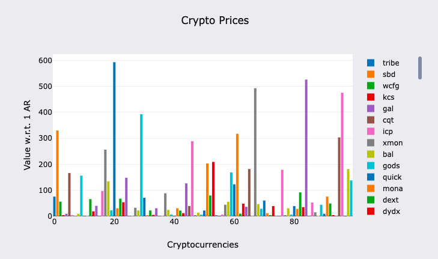

# 0rbit price graph 

[](https://ide.betteridea.dev/import?id=2voE0ERMT6CCPRVEkTsotDR-dmHgfoSH6dvucL9rSQc)

- Needs the graph module
- Works best in BetterIDEa [Notebooks](/interfaces/notebook)

```lua
json = require("json")

_0RBIT = "BaMK1dfayo75s3q1ow6AO64UDpD9SEFbeE8xYrY2fyQ"
_0RBT_TOKEN = "BUhZLMwQ6yZHguLtJYA5lLUa9LQzLXMXRfaq9FVcPJc"

FEE_AMOUNT = "1000000000000" -- 1 $0RBT
BASE_URL = "https://cdn.jsdelivr.net/npm/@fawazahmed0/currency-api@latest/v1/currencies/ar.min.json"

ReceivedData = {}
```

```lua
Handlers.add(
    "Receive-Data",
    Handlers.utils.hasMatchingTag("Action", "Receive-Response"),
    function(msg)
        local res = json.decode(msg.Data)
        ReceivedData = res
        print("You have received the data from the 0rbit process.")
    end
)
```

NOTE: You need to hold $0RBT tokens to use the 0rbit oracles

```lua
Send({
    Target = _0RBT_TOKEN,
    Action = "Transfer",
    Recipient = _0RBIT,
    Quantity = FEE_AMOUNT,
    ["X-Url"] = BASE_URL,
    ["X-Action"] = "Get-Real-Data"
})
```

```lua
price_graph = NewGraph()
SetTitle(price_graph, "Crypto Prices")
SetXLabel(price_graph, "Cryptocurrencies")
SetYLabel(price_graph, "Value w.r.t. 1 AR")

local x = 0
for key,val in pairs(ReceivedData.ar) do
    if val<600 and x<100 then -- Cap data for easily viewable bar chart
        AddBar(price_graph, x,val, key)
        x = x+1
    end
end

return ShowGraph(price_graph)
```

