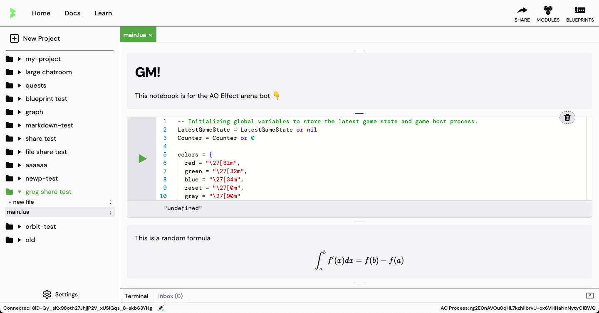
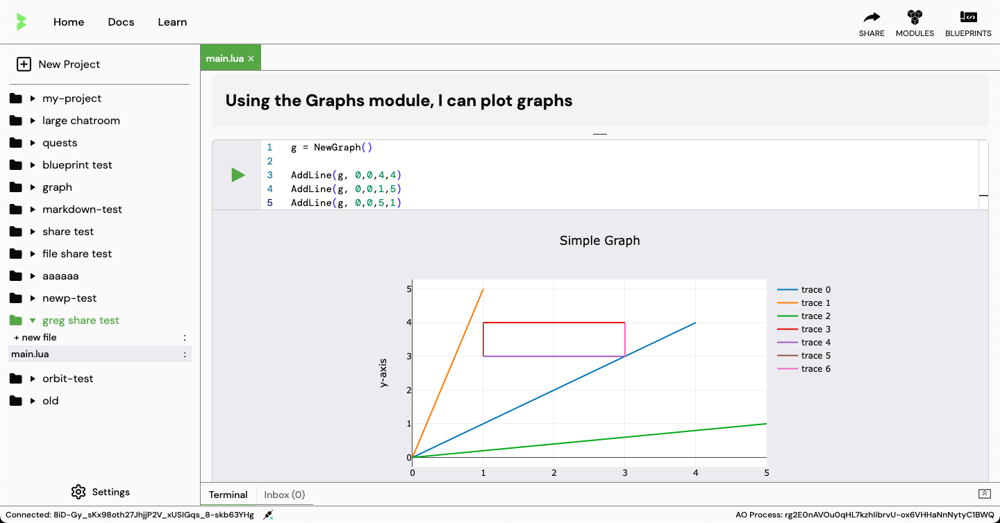

# Notebook Interface

The notebook interface is a unique cell based editing interface that allows you to write code in cells and run them individually. This is similar to Google Colab and Jupyter Notebooks, which also allows you to write markdown, latex or generate graphs

    
