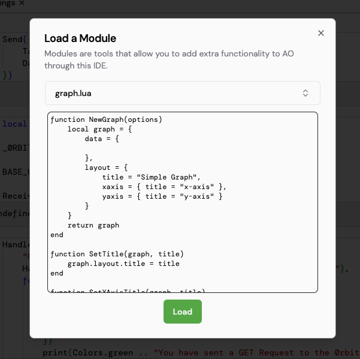

# What are modules?

Modules are LUA codes that add extra functionality to the IDE. They can be used to add new features, modify existing ones, or even create entirely new tools. Modules are written in LUA and are selectively by the user into their process.

In order for a module to work with the IDE, it returns data with special tags which tell the IDE how to behave.
For example to display a graph in a code cell, the module returns a table with a `__render_gfx` key, which is read my the IDE and the rest of the data is used to render the graph.

## Load a module

To load a module, click on the modules button in the top right. This will open a dialog box where you can select the module you want to load. Once you have selected the module, it will show the source code which will be loaded on the process. Click on the load button to load the module.

## Contributing to module development

Modules in BetterIDEa are fairly new and we would love to see more modules being developed.

If you have an idea for a module, feel free to reach out to us on our [Discord server](https://discord.gg/nm6VKUQBrA) or create an issue/pull request on our [GitHub repository](https://github.com/betteridea-dev/ide/).
