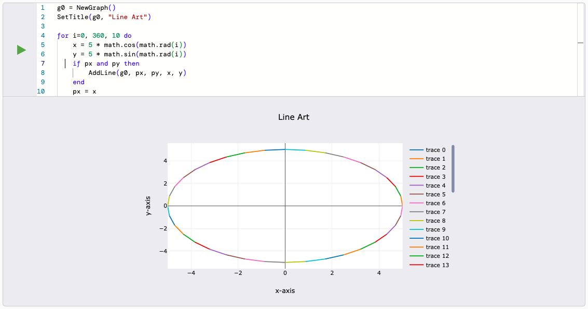

# Graph module

The graph module adds lua functions necessary to render graphs in the IDE code cells.

## Usage

### Create a Graph

`NewGraph()` creates a new graph object, which will be further used by other functions for plotting.

```lua
g0 = NewGraph()
```

### Set title

`SetTitle(graph, title)` sets the title of the graph object.

```lua
SetTitle(g0, "Sample Graph")
```

### Set X and Y axis labels

`SetXLabel(graph, label)` sets the label for the x-axis.

`SetYLabel(graph, label)` sets the label for the y-axis.

```lua
SetXLabel(g0, "Space")
SetYLabel(g0, "Time")
```

### Plot a point

To plot a point, you will need a graph object and the x and y coordinates of the point.

`AddPoint(graph, x, y)` adds a point to the graph object.

```lua
AddPoint(g0, 5,5) -- adds a point at x=5, y=5
```

### Plot a line

To plot a line, you will need a graph object the starting x,y coordinates and the ending x,y coordinates.

`AddLine(graph, x1, y1, x2, y2)` plots a line to the graph object.

```lua
AddLine(g0, 1,6, 10,10) -- draws a line from x=1,y=6 to x=10,y=10
```

### Render the graph

To render the graph, you will need a graph object.

`ShowGraph(graph)` renders the graph object in an IDE code cell.

```lua
ShowGraph(g0)
-- depending on code, you might need to return this function to render the graph
-- return ShowGraph(g0)
```

---

<details>
<summary>Example</summary>

```lua
g0 = NewGraph()
SetTitle(g0, "Circle")

for i=0, 360, 10 do
    x = 5 * math.cos(math.rad(i))
    y = 5 * math.sin(math.rad(i))
    if px and py then
        AddLine(g0, px, py, x, y)
    end
    px = x
    py = y
end

return ShowGraph(g0)
```

The above code draws a circle from multiple lines.



</details>

