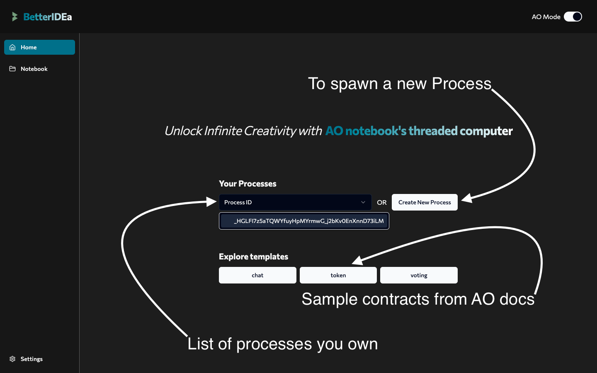
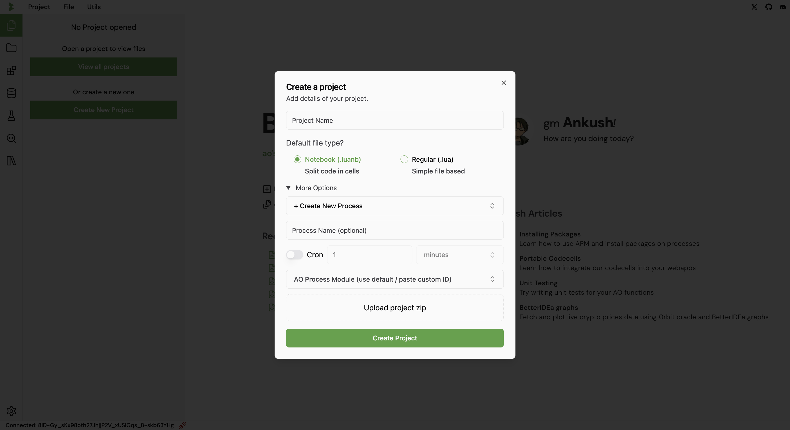

# The Notebook Interface

On visiting the [IDE](https://ide.betteridea.dev/), you will be greeted with this landing page.

Simply connect your ArConnect wallet and you are ready to start building your AO processes.

On the left you can view a list of your projects and the option to create a new one.

Start by connecting your wallet and creating a new project.

Enter a project name, choose a pre-existing process or create a new one to be used for this project.

If you choose to create a new process, you have to option to assign a name to the process.

Templates are predefined common code snippets that can be used to speed up the development process.

Next you have two options to choose from, the notebook interface or the file based editor.

