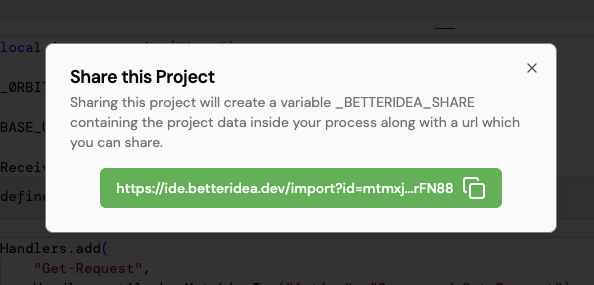

import { Callout } from 'nextra/components'

# Share Project

BetterIDEa allows you to share your projects with anyone easily.

All you have to do is click on the share button in the top right area, which will open a popup with a link to your project.

You can share this link with anyone, and when they open it, a new project will be created in their workspace with the same files and code as yours.

<Callout type="info" emoji="ℹ️">
    The project data gets stored in a `_BETTERIDEA_SHARE` variable on the process which shared the project. The same data is read when someone opens the shared link.
</Callout>